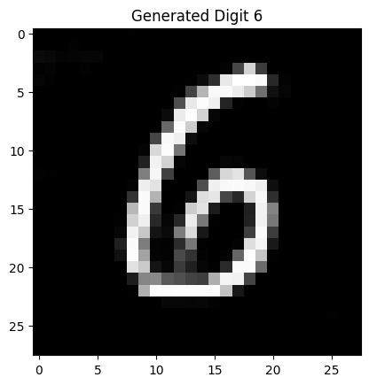

# 🌌 Conditional GAN (CGAN)

A modular implementation of a **Conditional Generative Adversarial Network (CGAN)** using a **Convolutional (DCGAN-style)** architecture in **PyTorch**. This project is designed to synthesize **specific, user-defined** handwritten digits (0-9) from the **MNIST** dataset.

## ✨ Features

  * **Modular PyTorch Architecture:** Code is cleanly separated into files for models (`model.py`), training (`train.py`), and inference (`inference.py`).
  * **Conditional Convolutional Architecture:** Both the Generator and Discriminator are conditioned on class labels, allowing for precise, on-demand image generation.
  * **Conditional MNIST Generation:** Successfully trains to generate specific $28 \times 28$ grayscale digits.
  * **Optimized for CUDA:** The training script automatically leverages a **CUDA-enabled GPU** if available.
  * **Stable Training:** Achieved a competitive and stable adversarial balance throughout 50 epochs.

## 📁 Project Structure

The project is organized for clarity and maintainability:

| File | Purpose |
| :--- | :--- |
| `model.py` | Defines the **Generator (G)** and **Discriminator (D)** network architectures. |
| `train.py` | Contains the **main training loop**, optimizer setup, data loading, loss calculations, and model saving. |
| `inference.py` | Script for **loading the saved generator** and producing samples for a *specific digit*. |

-----

## 🚀 Getting Started

### Prerequisites

You need Python and the following libraries installed:

```bash
pip install torch torchvision matplotlib
```

### Running the Project

1.  **Clone the repository:**
    ```bash
    git clone <YOUR_REPO_URL>
    cd cgan-project
    ```
2.  **To Start Training (50 Epochs):**
    ```bash
    python train.py
    ```
    *(This will save `generator_weights.pth` and `discriminator_weights.pth`)*
3.  **To Generate New Samples (e.g., the digit '6'):**
    ```bash
    python inference.py
    ```

-----

## 🧠 Architecture Details

### 1️⃣ Generator (G)

The Generator maps a 100-dimensional noise vector $\mathbf{z}$ and a class label $y$ to a $1 \times 28 \times 28$ image.

  * **Input:** Random noise vector $\mathbf{z} \in \mathbb{R}^{100}$ **AND** a label $y \in \{0, ..., 9\}$
  * **Output:** Generated Image $\mathbf{x}' \in \mathbb{R}^{1 \times 28 \times 28}$

**Layer-by-Layer Flow:**

1.  The label $y$ is one-hot encoded (e.g., $y=2 \rightarrow [0, 0, 1, 0, ...]$).
2.  The noise $\mathbf{z}$ (100 dims) and one-hot label (10 dims) are concatenated to form an input vector of 110 dimensions.
3.  `Linear` layer maps $110 \rightarrow (256 \times 7 \times 7)$.
4.  Reshaped to a $(256, 7, 7)$ feature map.
5.  `ConvTranspose2d` block (upsamples) $(256, 7, 7) \rightarrow (128, 14, 14)$.
6.  `ConvTranspose2d` block (upsamples) $(128, 14, 14) \rightarrow (64, 28, 28)$.
7.  `ConvTranspose2d` (final layer) $(64, 28, 28) \rightarrow (1, 28, 28)$.
8.  **`Tanh`** activation scales the output to $[-1, 1]$.

### 2️⃣ Discriminator (D)

The Discriminator takes an image $\mathbf{x}$ and its corresponding label $y$ and outputs the probability of the image being real *given that label*.

  * **Input:** Image $\mathbf{x} \in \mathbb{R}^{1 \times 28 \times 28}$ **AND** a label $y \in \{0, ..., 9\}$
  * **Output:** Single scalar probability $D(\mathbf{x}, y) \in [0, 1]$

**Layer-by-Layer Flow:**

1.  The label $y$ is passed through an `nn.Embedding` layer to create a $(1, 28, 28)$ feature map.
2.  The input image (1 channel) and the label embedding (1 channel) are concatenated $\rightarrow (2, 28, 28)$.
3.  `Conv2d` block (downsamples) $(2, 28, 28) \rightarrow (64, 14, 14)$.
4.  `Conv2d` block (downsamples) $(64, 14, 14) \rightarrow (128, 7, 7)$.
5.  `Conv2d` block (downsamples) $(128, 7, 7) \rightarrow (256, 3, 3)$.
6.  `Flatten` layer converts the $256 \times 3 \times 3$ map into a vector of 2304 features.
7.  `Linear` layer maps $2304 \rightarrow 1$.
8.  **`Sigmoid`** activation outputs the final probability.

-----

## ⚙️ Training Details

  * **Loss Function:** **Binary Cross-Entropy (BCE) Loss** ($\text{nn.BCELoss}$).
  * **Optimizer:** **Adam** for both G and D.
      * Learning Rate (`lr`): $\mathbf{0.0002}$
      * Betas (`betas`): $\mathbf{(0.5, 0.999)}$
  * **Batch Size:** $\mathbf{128}$
  * **Epochs:** $\mathbf{50}$
  * **Latent Dimension:** $\mathbf{100}$
  * **Hardware:** Trained on a **CUDA-enabled GPU**.

-----

## 📊 Results and Stability Analysis

### Training Loss Analysis

The training achieved a competitive, stable balance, confirmed by the loss values sampled from the final batch of each 10-epoch interval.

| Epoch | D Loss (Batch \~400/469) | G Loss (Batch \~400/469) |
| :---: | :---: | :---: |
| 10 | 0.5675 | 0.7488 |
| 20 | 0.8295 | 0.9899 |
| 30 | 0.3629 | 0.7759 |
| 40 | 0.4589 | 0.8671 |
| 50 | **0.4832** | **0.8415** |

  * **Observation:** The losses consistently fluctuate around the ideal Nash equilibrium point (which for BCE loss is $\ln(2) \approx 0.693$).
  * **Conclusion:** This demonstrates a healthy and stable adversarial dynamic. Neither the Generator nor the Discriminator "won" (i.e., loss did not collapse to 0). The final D Loss of $\mathbf{0.48}$ shows the Discriminator is still effective (it's not being fooled 100% of the time), while the final G Loss of $\mathbf{0.84}$ shows the Generator is consistently producing fakes that are good enough to challenge the Discriminator. This "tug-of-war" is the desired outcome.


### Final Generated Samples (Epoch 50)

The Generator successfully learned to produce coherent digits *based on the input label*.

**Conditionally Generated Digit '6' (from `inference.py`):**



-----

## 🤝 Contributing

Contributions, issues, and feature requests are welcome\!

## 📄 License

This project is open-sourced under the MIT License.